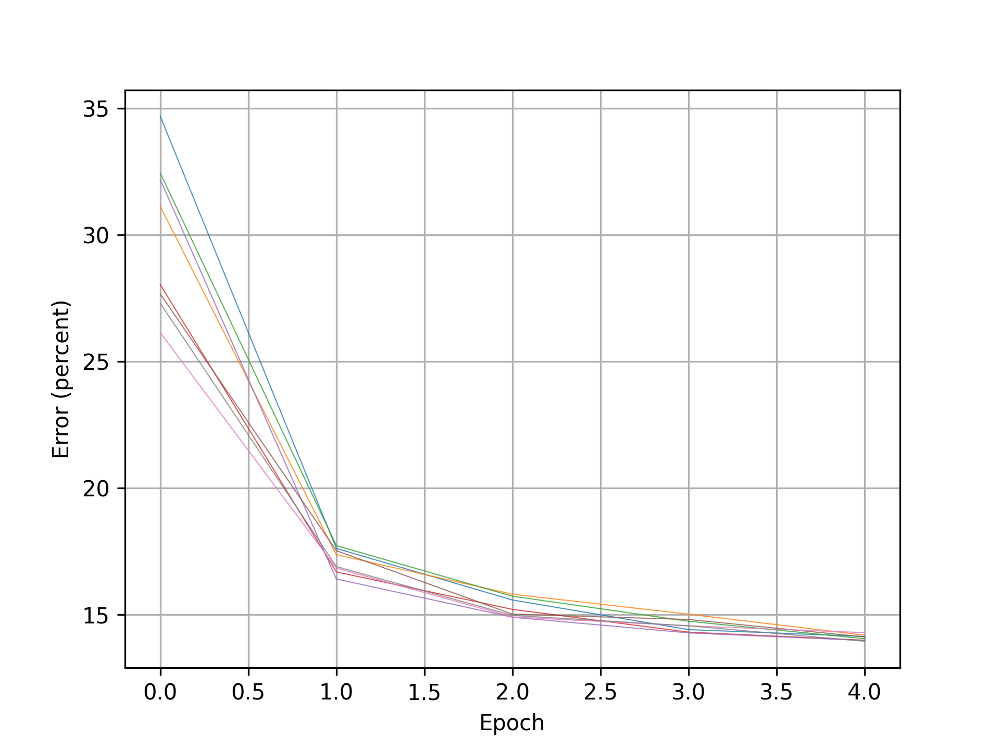

# Sharpened Cosine Similarity
A layer implementation for PyTorch

## Install
At your command line:

```bash
git clone https://github.com/brohrer/sharpened_cosine_similarity_torch.git
```
You'll need to install or upgrade PyTorch if you haven't already.
If `python3` is the command you use to invoke Python at your command line:

```bash
python3 -m pip install torch torchvision --upgrade
```

## Demo
Run the Fashion MNIST demo to see sharpened cosine similarity in action.

```bash
cd sharpened_cosine_similarity_torch
python3 demo_fashion_mnist.py
```

When you run this it will take a few extra minutes the first time through to download and extract
the [Fashion MNIST](https://github.com/zalandoresearch/fashion-mnist) data set. Its less than 100MB
when fully extracted.

I run this entirely on laptop CPUs. I have a dual-core i7 that takes about 90 seconds per epoch and
an 8-core i7 that takes about 45 seconds per epoch. Your mileage may vary.

There's also a CIFAR-10 demo at `demo_cifar10.py`.

## Monitor
You can check on the status of your runs at any time. In another console navigate to the smae directory
and run

```bash
python3 show_results.py
```

This will give a little console summary like this

```
testing errors for version test
mean  : 14.08%
stddev: 0.1099%
stderr: 0.03887%
n runs: 8
```

and drop a couple of plots like this in the `plots` directory showing how the
classification error on the test data set decreases with each pass through
the training data set.



The demo will keep running for a long time if you let it. Kill it when you get bored of it.
If you want to pick the sequence of runs back up, re-run the demo and it will load all
the results it's generated so far and append to them.

## Track
If you'd like to experiment with the sharpened cosine similarity code, the demo, or with other data sets,
you can keep track of each new run by adding a version argument at the command line.

To start a run with version string "v37" run

```bash
python3 demo_fashion_mnist.py v37
```

To check on its progress

```bash
python3 show_results.py v37
```

The version string can be arbitrarily descriptive, for example "3_scs_layer_2_fully_connected_layer_learning_rate_003",
but keep it alphanumeric with underscores.

## Credit where it's due
The code here is based on and copy/pasted heavily from 

* [code](https://github.com/ZeWang95/scs_pytorch/blob/main/scs.py)
from [@ZeWang95](https://github.com/ZeWang95)
([@ZeWang46564905 on Twitter](https://twitter.com/ZeWang46564905/status/1488371679936057348?s=20&t=lB_T74PcwZmlJ1rrdu8tfQ))

* [code](https://github.com/oliver-batchelor/scs_cifar/blob/main/src/scs.py)
from [@Oliver-Batchelor](https://github.com/oliver-batchelor)
([@oliver_batch on Twitter](https://twitter.com/oliver_batch/status/1488695910875820037?s=20&t=QOnrCRpXpOuC0XHApi6Z7A))

* [code](https://github.com/StephenHogg/SCS/blob/main/SCS/layer.py) from and conversations with
[@StephenHogg](https://github.com/StephenHogg) 
([@whistleposse on Twitter](https://twitter.com/whistle_posse/status/1488656595114663939?s=20&t=lB_T74PcwZmlJ1rrdu8tfQ))

* the TensorFlow [implementation](https://colab.research.google.com/drive/1Lo-P_lMbw3t2RTwpzy1p8h0uKjkCx-RB)
and [blog post](https://www.rpisoni.dev/posts/cossim-convolution/)
from Raphael Pisoni ([@ml_4rtemi5 on Twitter](https://twitter.com/ml_4rtemi5)).

## Background

The idea behind sharpened cosine similarity first surfaced as
[a Twitter thread](https://twitter.com/_brohrer_/status/1232063619657093120)
in 2020.


